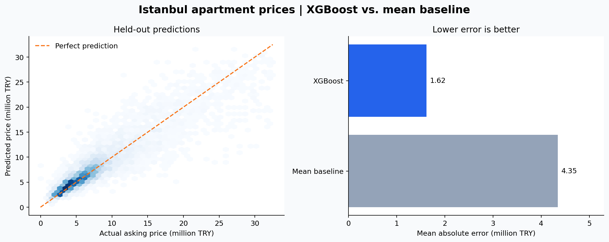

<div align="center">

# Istanbul Apartment Price Prediction

**From property listings to price estimates with XGBoost.**

Python · pandas · scikit-learn · XGBoost · Jupyter

[Explore the notebook](HouseProject.ipynb) · [Türkçe](README.tr.md) · [Dataset & attribution](DATA_SOURCE.md)

</div>

## Project at a glance

How well can location, apartment size and building attributes explain an Istanbul apartment's asking price? This project explores **24,767 listings** and builds a regression pipeline with missing-value imputation, target encoding and XGBoost.

The original modeling workflow is retained, with explanations, a baseline comparison and reproducible evaluation outputs added for review.

| Data | Model inputs | Evaluation |
| --- | --- | --- |
| 24,767 raw listings, 30 columns | 19 features after selection | 5,749 held-out listings |
| 22,995 listings after filtering | Numeric + categorical preprocessing | 75/25 split, seed 42 |

## Results

| Model | Test R² ↑ | MAE (TRY) ↓ | RMSE (TRY) ↓ |
| --- | ---: | ---: | ---: |
| Mean-price baseline | −0.00003 | 4,345,701 | 5,923,879 |
| **XGBoost pipeline** | **0.8222** | **1,619,965** | **2,498,006** |

XGBoost reduces mean absolute error by **62.7%** relative to the mean-price baseline on this split. R² is an explained-variation metric, **not prediction accuracy**. Results apply to the filtered sample; the pre-split price filter is an evaluation limitation described below.



Metrics were reproduced by executing every code cell in order using the versions in [requirements.txt](requirements.txt). Exact values are in [metrics.json](reports/metrics.json); the recorded environment is in [environment.json](reports/environment.json).

## What the project demonstrates

- **Data inspection:** schema, missingness, descriptive statistics and categorical values.
- **Feature selection:** removal of `price_per_sqm`, which contains information derived from the target, plus identifiers, timestamps and several sparse columns.
- **Preprocessing:** median imputation for numerical features; most-frequent imputation and cross-fitted `TargetEncoder` for categorical features.
- **Pipeline design:** a `ColumnTransformer` and XGBoost regressor fitted together on training data.
- **Evaluation:** held-out R², MAE, RMSE and a simple baseline on the same test rows.
- **Persistence:** a saved pipeline containing both preprocessing and the fitted regressor.

## Workflow

```text
Raw listings → feature selection → price / maintenance filtering
             → 75/25 train-test split
             → imputation + target encoding → XGBoost → evaluation
```

Missing maintenance fees are assigned zero. Prices are filtered to Q1 − 3×IQR through Q3 + 3×IQR (upper bound: 32.5 million TRY), and maintenance fees must be below 5,000 TRY. This leaves 17,246 training rows and 5,749 test rows.

The categorical encoder uses five internal folds for training encodings. This is **not five-fold cross-validation of model performance**. XGBoost uses its default parameters; no hyperparameter search is claimed.

## Run locally

Tested with **Python 3.13.9**. From the project directory:

```bash
python -m venv .venv
```

Activate the environment:

```powershell
# Windows PowerShell
.venv\Scripts\Activate.ps1
```

```bash
# macOS / Linux
source .venv/bin/activate
```

Install dependencies and open the notebook:

```bash
python -m pip install -r requirements.txt
python -m jupyterlab HouseProject.ipynb
```

Select the environment's Python kernel and **Restart Kernel and Run All Cells**. Keep the CSV beside the notebook. Execution regenerates `houseprice.pkl` and the evaluation files under `reports/`.

The saved pickle is tied to its library versions. Regenerate it if your environment differs, and only load pickle files from a trusted source.

## Repository contents

| File | Purpose |
| --- | --- |
| [HouseProject.ipynb](HouseProject.ipynb) | Executed analysis, training and evaluation |
| `istanbul_apartment_prices_2026.csv` | Original supplied dataset, unchanged |
| `houseprice.pkl` | Fitted preprocessing and model pipeline |
| [requirements.txt](requirements.txt) | Tested model and analysis dependencies |
| [reports/](reports/) | Metrics, comparison chart and environment versions |
| [DATA_SOURCE.md](DATA_SOURCE.md) | Dataset credit and license reference |

## Limitations and next steps

1. **Pre-split target filtering:** IQR bounds are calculated from the complete dataset before splitting, so held-out prices influence sample selection. A stronger follow-up should split first and estimate data-dependent filters using training data only.
2. **Generalization:** the random split does not establish performance on future listings or unseen districts. Duplicate and near-duplicate property leakage has not been ruled out.
3. **Coverage:** price and maintenance filters exclude some expensive properties. The source contains asking prices collected in March 2026, not verified sale prices.
4. **Data quality:** assigning zero to unknown maintenance fees is an assumption; implausible values and missingness merit further auditing.

Next experiments: duplicate-aware and temporal validation, district-level error analysis, and model comparison with training-only tuning.

## Data credit

Dataset: **Istanbul Apartment Prices 2026**, collected by **Enes Ulusoy**, published on [Kaggle](https://www.kaggle.com/datasets/brahimenesulusoy/istanbul-apartment-prices-2026). The Kaggle card lists **CC BY-SA 4.0**. See [DATA_SOURCE.md](DATA_SOURCE.md) for attribution and the dataset license link. Dataset collection is credited to its original author; this repository presents the modeling work.

**Author:** [Cengizhan Keskin](https://github.com/cengizhankeskin)
